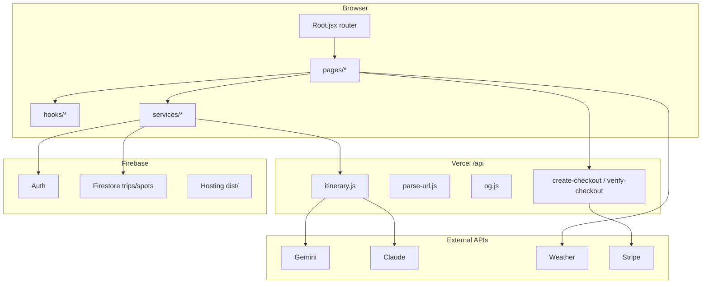

# TRVLTOO Codebase Map (v0.1)

AI-powered day-trip planner for Thailand. React SPA + Vercel serverless API + Firebase.

## Repository layout

```
trvltoo/
├── src/                 # React frontend (Vite)
├── api/                 # Vercel serverless routes
├── functions/           # Firebase Cloud Functions
├── public/              # Static assets, PWA icons
├── docs/                # Project documentation
├── knowledge/           # Curated destination copy (markdown)
├── firebase.json        # Firebase Hosting + Firestore rules path
├── vercel.json          # SPA rewrites for Vercel
├── vite.config.js       # Build, PWA (Workbox), API proxy
└── vitest.config.js     # Unit tests (src/utils, api/_lib)
```

## Runtime architecture



## Frontend (`src/`)

| Path | Role |
|------|------|
| `main.jsx` | Entry: Sentry, mounts `Root` |
| `Root.jsx` | Router, PWA splash, lazy route chunks |
| `pages/Planner.jsx` | Core trip planner (“Vibe Engine”) at `/plan` |
| `pages/Landing.jsx` | Marketing landing at `/` |
| `pages/Trips.jsx`, `NewTrip.jsx`, `TripDetail.jsx` | Saved trips CRUD |
| `pages/SharedTrip.jsx` | Public share view `/trip/:id` |
| `pages/Spots.jsx` | Spot collector |
| `pages/MapPage.jsx` | Leaflet map |
| `pages/Destinations.jsx` | Destination browser |
| `pages/Upgrade.jsx` | Pro / Stripe upgrade |
| `pages/InvitePage.jsx` | Trip invites |
| `firebase.js` | Firebase app, auth, Firestore, analytics |
| `db/trips.js` | Trip persistence helpers |
| `services/geminiService.js` | Itinerary generation (client → `/api/itinerary`) |
| `services/claudeService.js` | Optional Claude path |
| `services/firestoreService.js` | Firestore reads/writes |
| `services/weatherService.js` | Weather for planner |
| `activityPool.js` | Activity pool + slot building |
| `apiService.js` | Static feature data + pool builders (legacy naming) |
| `data/destinations.js` | 12 Thailand destinations + areas |
| `data/personas.js`, `data/ui.js`, `data/cities.js` | UX constants |
| `hooks/useAuth.js`, `useTrips.js`, `useSpots.js`, `usePlan.js` | Shared state |
| `utils/security.js`, `urlParser.js`, `exportItinerary.js` | Validation, export |
| `components/` | UI: planner slots, map, landing, auth, Pro gate |

### Routes (`Root.jsx`)

| Path | Page |
|------|------|
| `/` | Landing |
| `/plan` | Planner |
| `/spots` | Spots |
| `/trips`, `/trips/new`, `/trips/:id` | Trips |
| `/trip/:id` | SharedTrip |
| `/map` | Map |
| `/invite/:token` | Invite |
| `/destinations` | Destinations |
| `/upgrade` | Upgrade |

## API (`api/`)

| File | Purpose |
|------|---------|
| `itinerary.js` | AI itinerary generation (Gemini/Claude) |
| `parse-url.js` | URL → spot metadata |
| `og.js` | Open Graph HTML for shared trips |
| `create-checkout.js`, `verify-checkout.js` | Stripe Pro checkout |
| `_lib/sanitize.js`, `urlSafety.js` | Input sanitization |

Local dev: `vite` proxies `/api` → `http://localhost:3000` (run `vercel dev`).

## Firebase (`functions/`, `firestore.rules`)

- `functions/index.js` — Cloud Functions entry
- `functions/seed-activities.js` — Seed script (uses env project ID)
- Hosting serves `dist/`; Firestore rules in repo root

## Configuration & env

Copy `.env.example` → `.env` / `.env.local`. Key prefixes:

- `VITE_FIREBASE_*` — client Firebase
- `VITE_GEMINI_*` / server keys for AI
- `VITE_SENTRY_DSN` — optional error reporting
- Stripe keys for `/upgrade` flow

Never commit `.env`, service accounts, or `.venv-secrets/`.

## Scripts

| Command | Action |
|---------|--------|
| `npm run dev` | Vite dev server (:5173) |
| `npm run build` | Production bundle → `dist/` |
| `npm run lint` | ESLint |
| `npm test` | Vitest (project tests only) |
| `firebase deploy` | Hosting + rules (+ functions) |

## Tests

Vitest includes only project tests under `src/utils/**` and `api/_lib/**` (excludes `node_modules` and `functions/node_modules`).

## Versioning

- Package version: `0.1.0` (first open-source baseline)
- See `CHANGELOG.md` for release notes